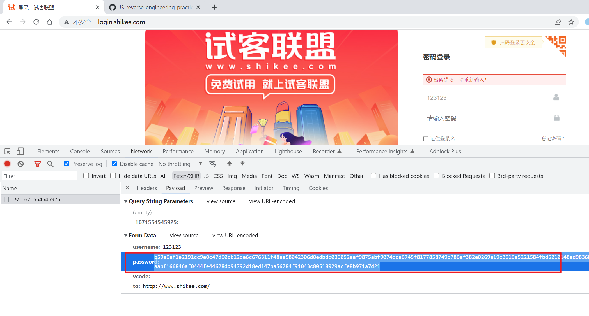
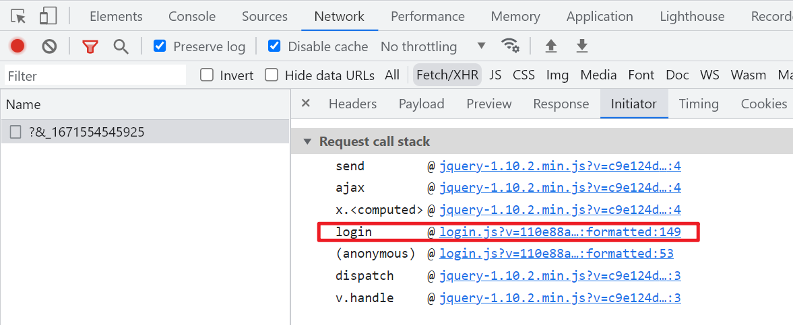
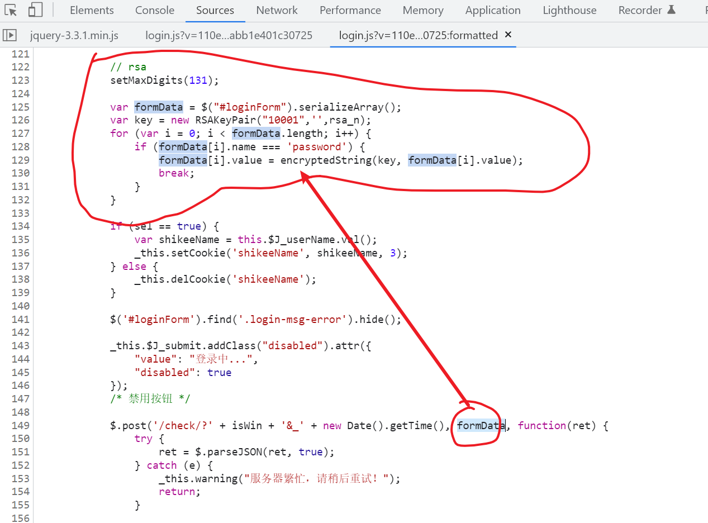
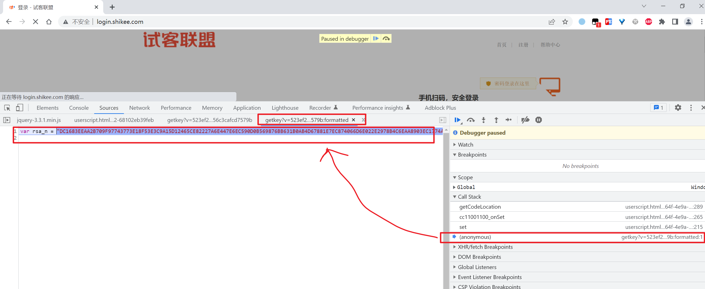
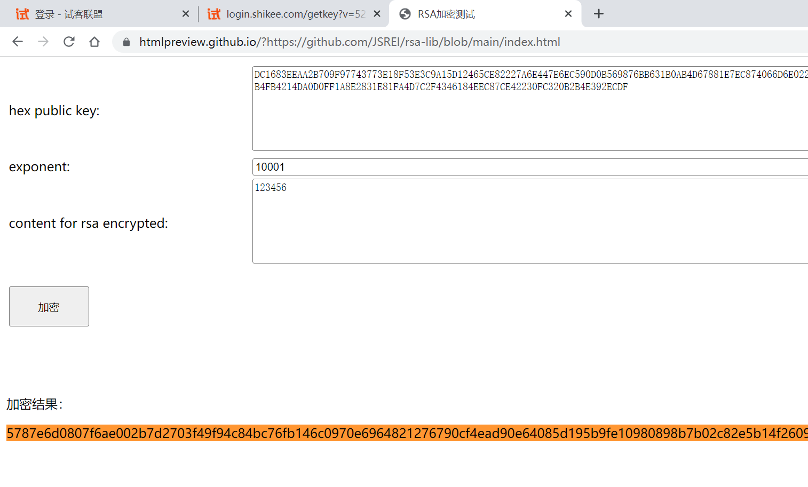
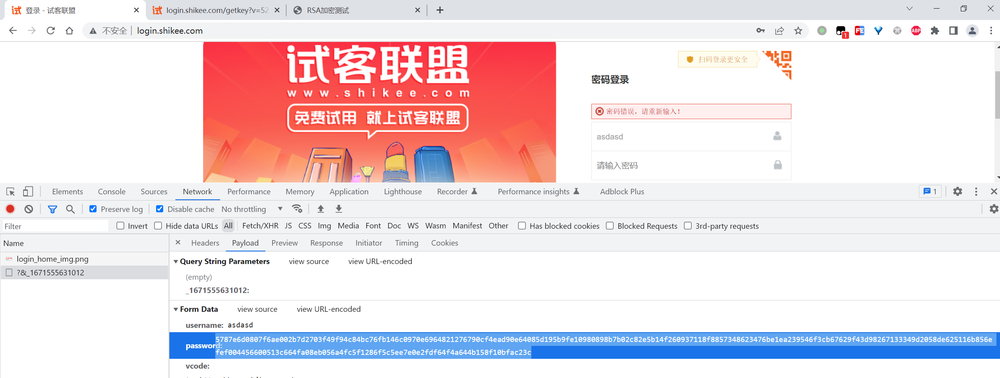

# 试客联盟登录passwd

地址： 

```
http://login.shikee.com/
```

登录的时候有个加密参数：



通过这个请求的调用栈，直接定位到登录所在的栈帧：



跟进去这个栈帧，通过阅读代码，得知formData中存放的就是参数，继续往前追，看看这个参数是怎么来的：



这个就是passwd的加密逻辑：

```js
            // rsa
            setMaxDigits(131);

            var formData = $("#loginForm").serializeArray();
            var key = new RSAKeyPair("10001",'',rsa_n);
            for (var i = 0; i < formData.length; i++) {
                if (formData[i].name === 'password') {
                    formData[i].value = encryptedString(key, formData[i].value);
                    break;
                }
            }
```

这个`rsa_n`就是rsa的公钥，是个挂在window上的全局变量，接下来通过插件：

```
https://github.com/JSREI/js-window-monitor-debugger-hook
```

来定位到这个变量初始化的地方：




是这个url：

```
http://login.shikee.com/getkey?v=523ef2c063a04c77f156c3cafcd7579b
```

是个JSONP的请求，返回的公钥是：

```
DC1683EEAA2B709F97743773E18F53E3C9A15D12465CE82227A6E447E6EC590D0B569876BB631B0AB4D67881E7EC874066D6E022E2978B4C6EAA8903EC1774AAE040A3BEAF9C2B48730ADD46BEF5F0C8109DB6FCEFED0F4A84CCD7AFFDB4FB4214DA0D0FF1A8E2831E81FA4D7C2F4346184EEC87CE42230FC320B2B4E392ECDF
```

在这里验证一下：

```
https://github.com/JSREI/rsa-libs
```

加密同一个内容`123456`：



得到的结果：

```
5787e6d0807f6ae002b7d2703f49f94c84bc76fb146c0970e6964821276790cf4ead90e64085d195b9fe10980898b7b02c82e5b14f260937118f8857348623476be1ea239546f3cb67629f43d98267133349d2058de625116b856efef004456600513c664fa08eb056a4fc5f1286f5c5ee7e0e2fdf64f4a644b158f10bfac23c
```

与在目标网站上的登录请求对比：



是完全相等的，至此，证明是一个RSA加密，同时公钥的获取方式也拿到了。


